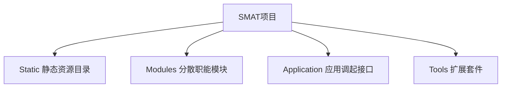
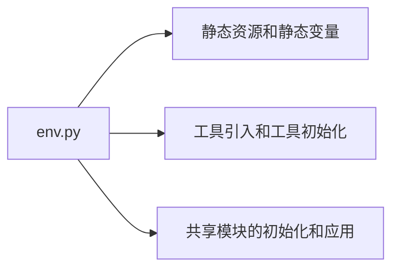
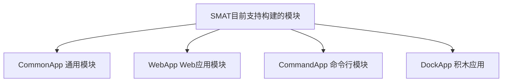

# SMAT脚手架

## SMAT设计理念

SMAT包含三个主要的设计理念，分散、共享和聚合。整合SMAT脚手架所构建的项目，秉着职能分散、职能共享、项目聚合的理念构成，是一个大项目可以分解成若干小项目，并在每个小项目中，厘清职能，分散开发。同时支持在线安装功能拓展套件，基于smat工具。
SMAT设计理念的核心是区域自治，但是共享中央资源。每个SMAT模块都相对独立自制，同时能够供给中央足够多的保护。同时使用smat构建的应用，能够有效共享给对应的项目。
## SMAT项目架构



## SMAT技术架构
SMAT项目中有一个核心文件,既env.py。其主要功能如下

env.py中，对大量的变量和工具进行统一的管理和陈列，所有需要使用工具的模块，可以通过直接调起Tools的形式进行调用。

## Tools设计

Tools既本地工具箱，通过SMAT进行管理，并且在env中进行初始化的工具盒。

### Tool设计
每一个Tool也是一个满足SMAT架构的项目，通过Application对工具进行调用。Tool本身可以使用Tool。

## SMAT支持的模块



## SMAT快速部署

SMAT支持快速部署，通过pip可以直接安装SMAT工具。
```bash
pip install smat
```

## SMAT命令行工具的使用

### 初始化
使用init指令，进行项目初始化。
```bash
smat init --type=web_app SMAT_WEB_APP
```
支持的类型：
|项目类型|项目描述|
|-----|-----|
|common_app|一般性Application|
|web_app|WebApplication 用于架设服务器后端应用|
|command_app|CommandApplication 命令行应用|
|dock_app|DockApplication 积木应用|


### 下载工具
下载对应的工具
```bash
smat download tool_name
```